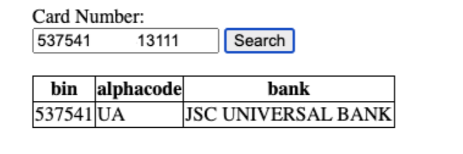

# Bank-Issuer-Service

### Guides

The following guides illustrate how to use some features concretely:

1. How to run locally:
    - docker-compose up --build (to run PostgreSQL in docker)
    - mvn spring-boot:run (to run Spring Boot application locally)

2. API:
   curl --location --request POST 'http://localhost:8080/bank-issuer-service/api/bin' \
   --header 'Content-Type: application/json' \
   --data-raw '{
   "card": "537541******3111"
   }'

3. HTML UI:
   http://localhost:8080/bank-issuer-service/issuing-bank-search.html

### Task

Тема завдання: розробити web-сервіс, який повертає за номером картки інформацію про
банк-емітент
Основні вимоги до розробки:
● Java 11 +
● Spring Boot 2.7.x +
● Gradle or Maven build tool
● PostgreSQL RDBMS
Опис завдання:
1. Оновлення довідника карткових діапазонів:
   ● Сервіс із частотою 1 раз на годину запитує онлайн довідник карткових
   діапазонів за адресою
   https://ecom-bininfo.s3.eu-west-1.amazonaws.com/bininfo.json.zip
   ● Отримані дані зберігаються у БД, старі дані - видаляються.
   ● У процесі оновлення даних сервіс повинен працювати штатно, без
   даунтайму.
   ● Поточний набір даних залишається активним до завершення оновлення та
   перемикання на новий набір даних.
   ● Після завантаження нових даних необхідно забезпечити переключення на
   новий набір даних та видалити попередній набір даних.
2. Структура запису онлайн довідника:
   {
   "bin": "546084",
   "min_range": "5460845800000000000",
   "max_range": "5460845899999999999",
   "alpha_code": "US",
   "bank_name": "FIRST NATIONAL BANK OF OMAHA"
   }
   ●
   ●
   ●
   ●
   ●
   bin - ідентифікатор банку
   min_range - початок діапазону
   max_range - кінець діапазону
   alpha_code - код країни банку-емітента (ISO 3166-1 alpha-2)
   bank_name - назва банку3. Умови визначення входження номера картки до карткового діапазону.
   Оскільки номер картки має довжину 16 символів, а початкове та кінцеве значення
   карткового діапазону має довжину 19 символів, для визначення входження номера
   картки до карткового діапазону вихідний номер картки необхідно доповнити нулями
   праворуч до 19 знаків.
   Наприклад, вихідний номер картки 4561230000000008,
   пошук діапазону необхідно виконувати за значенням 4561230000000008000
4. REST API сервиса.
   ● POST REQUEST::
   {
   "card": "537541******3111"
   }
   ● RESPONSE:
   {
   "bin": "537541",
   "alphacode": "UA",
   "bank": "JSC UNIVERSAL BANK"
   }
5. Web UI.
   Проста HTML сторінка з полем для введення номера картки та кнопкою "Пошук".
   Результат пошуку необхідно відобразити на сторінці у будь-якому вигляді.

